# E-Commerce Platform Architecture - Mermaid Diagrams

## How to Use These Diagrams

1. **Copy the code** from any diagram below
2. **Visit** [mermaid.live](https://mermaid.live) or [mermaid-js.github.io/mermaid-live-editor](https://mermaid-js.github.io/mermaid-live-editor)
3. **Paste the code** into the editor
4. **View and export** the rendered diagram (PNG, SVG, PDF)

---

## 1. High-Level System Architecture

```mermaid
graph TD
    %% External Layer
    Users[👥 500K Daily Users] --> CDN[🌐 Azure Front Door Premium<br/>Global CDN + WAF + DDoS]
    
    %% Edge Layer
    CDN --> AGW[🔀 Application Gateway v2<br/>Regional Load Balancer<br/>SSL Termination]
    
    %% API Gateway Layer
    AGW --> APIM[🚪 API Management Premium<br/>Rate Limiting<br/>API Versioning<br/>Authentication]
    
    %% Container Platform Layer
    APIM --> AKS1[🐳 AKS Cluster - Zone 1<br/>User Service<br/>Product Service<br/>Cart Service]
    APIM --> AKS2[🐳 AKS Cluster - Zone 2<br/>Payment Service<br/>Inventory Service<br/>Order Service]
    APIM --> AKS3[🐳 AKS Cluster - Zone 3<br/>Notification Service<br/>Analytics Service<br/>Search Service]
    
    %% Data Layer
    AKS1 --> SQL[(🗄️ Azure SQL Database<br/>Business Critical<br/>Always On AG)]
    AKS1 --> Cosmos[(🌍 Azure Cosmos DB<br/>Multi-region Write<br/>Product Catalog)]
    AKS2 --> Redis[(⚡ Azure Cache for Redis<br/>Premium Cluster<br/>Session Store)]
    AKS3 --> ServiceBus[📨 Service Bus Premium<br/>Event Streaming<br/>Message Queuing]
    
    %% Security & Management
    AKS1 -.-> KeyVault[🔐 Azure Key Vault Premium<br/>HSM Protected Keys<br/>Secrets Management]
    AKS2 -.-> KeyVault
    AKS3 -.-> KeyVault
    
    %% Monitoring
    AKS1 -.-> Monitor[📊 Azure Monitor<br/>Application Insights<br/>Log Analytics]
    AKS2 -.-> Monitor
    AKS3 -.-> Monitor
    
    %% Backup & DR
    SQL -.-> Backup[💾 Azure Backup<br/>Site Recovery<br/>Cross-region Replication]
    Cosmos -.-> Backup
    Redis -.-> Backup
    
    %% Container Registry
    ACR[📦 Azure Container Registry<br/>Premium with Geo-replication] -.-> AKS1
    ACR -.-> AKS2
    ACR -.-> AKS3
    
    %% Styling
    classDef userLayer fill:#e1f5fe
    classDef edgeLayer fill:#f3e5f5
    classDef platformLayer fill:#e8f5e8
    classDef dataLayer fill:#fff3e0
    classDef securityLayer fill:#ffebee
    classDef opsLayer fill:#f1f8e9
    
    class Users userLayer
    class CDN,AGW edgeLayer
    class APIM,AKS1,AKS2,AKS3,ACR platformLayer
    class SQL,Cosmos,Redis,ServiceBus dataLayer
    class KeyVault securityLayer
    class Monitor,Backup opsLayer
```

---

## 2. Detailed Microservices Architecture

```mermaid
graph TB
    subgraph "External Traffic"
        Users[👥 Users] --> LB[🔀 Load Balancer]
    end
    
    subgraph "API Gateway Layer"
        LB --> APIM[🚪 API Management]
    end
    
    subgraph "AKS Cluster - Multi-Zone Deployment"
        subgraph "Zone 1 - Customer Services"
            APIM --> UserSvc[👤 User Service<br/>Authentication<br/>Profile Management]
            APIM --> ProductSvc[🏪 Product Service<br/>Catalog Management<br/>Search & Filter]
            APIM --> CartSvc[🛒 Cart Service<br/>Session Management<br/>Cart Operations]
        end
        
        subgraph "Zone 2 - Transaction Services"
            APIM --> PaymentSvc[💳 Payment Service<br/>Gateway Integration<br/>PCI DSS Compliance]
            APIM --> OrderSvc[📋 Order Service<br/>Order Processing<br/>Workflow Management]
            APIM --> InventorySvc[📦 Inventory Service<br/>Stock Management<br/>Real-time Updates]
        end
        
        subgraph "Zone 3 - Support Services"
            APIM --> NotificationSvc[📧 Notification Service<br/>Email, SMS, Push<br/>Event-driven]
            APIM --> AnalyticsSvc[📊 Analytics Service<br/>User Behavior<br/>Business Intelligence]
            APIM --> SearchSvc[🔍 Search Service<br/>Elasticsearch<br/>AI-powered Recommendations]
        end
    end
    
    subgraph "Data Layer"
        UserSvc --> SQL1[(🗄️ User Database<br/>Azure SQL)]
        ProductSvc --> Cosmos1[(🌍 Product Catalog<br/>Cosmos DB)]
        CartSvc --> Redis1[(⚡ Session Store<br/>Redis Cache)]
        
        PaymentSvc --> SQL2[(💳 Payment Database<br/>Azure SQL - Encrypted)]
        OrderSvc --> SQL3[(📋 Order Database<br/>Azure SQL)]
        InventorySvc --> Cosmos2[(📦 Inventory Database<br/>Cosmos DB)]
        
        NotificationSvc --> ServiceBus1[📨 Message Queue<br/>Service Bus]
        AnalyticsSvc --> Analytics[(📊 Analytics Store<br/>Cosmos DB)]
        SearchSvc --> Search[(🔍 Search Index<br/>Azure Cognitive Search)]
    end
    
    subgraph "Cross-cutting Concerns"
        AllServices[All Services] -.-> KeyVault[🔐 Key Vault<br/>Secrets & Certificates]
        AllServices -.-> Monitor[📊 Monitoring<br/>Application Insights]
        AllServices -.-> Logging[📝 Logging<br/>Log Analytics]
    end
    
    %% Service Communication
    OrderSvc <--> PaymentSvc
    OrderSvc <--> InventorySvc
    OrderSvc <--> NotificationSvc
    CartSvc <--> ProductSvc
    UserSvc <--> NotificationSvc
    AnalyticsSvc <--> UserSvc
    AnalyticsSvc <--> OrderSvc
    SearchSvc <--> ProductSvc
    
    %% Styling
    classDef service fill:#e3f2fd
    classDef database fill:#fff3e0
    classDef messaging fill:#f3e5f5
    classDef security fill:#ffebee
    classDef monitoring fill:#f1f8e9
    
    class UserSvc,ProductSvc,CartSvc,PaymentSvc,OrderSvc,InventorySvc,NotificationSvc,AnalyticsSvc,SearchSvc service
    class SQL1,SQL2,SQL3,Cosmos1,Cosmos2,Analytics database
    class ServiceBus1,Search messaging
    class KeyVault security
    class Monitor,Logging monitoring
```

---

## 3. Data Architecture & Flow

```mermaid
graph LR
    subgraph "Data Sources"
        WebApp[🌐 Web Application] --> Events[📊 User Events]
        MobileApp[📱 Mobile App] --> Events
        API[🔌 API Calls] --> Events
    end
    
    subgraph "Event Processing"
        Events --> EventHub[📨 Event Hub<br/>Real-time Ingestion]
        EventHub --> StreamAnalytics[🌊 Stream Analytics<br/>Real-time Processing]
    end
    
    subgraph "Transactional Data"
        StreamAnalytics --> SQLPrimary[(🗄️ Azure SQL Database<br/>Primary - East US 2<br/>Business Critical)]
        SQLPrimary --> SQLSecondary[(🗄️ Azure SQL Database<br/>Secondary - West US 2<br/>Geo Replica)]
    end
    
    subgraph "NoSQL Data"
        StreamAnalytics --> CosmosDB[(🌍 Azure Cosmos DB<br/>Multi-region Write<br/>Global Distribution)]
        CosmosDB --> CosmosReplica1[(🌍 Cosmos Replica<br/>West Europe)]
        CosmosDB --> CosmosReplica2[(🌍 Cosmos Replica<br/>Southeast Asia)]
    end
    
    subgraph "Caching Layer"
        SQLPrimary --> RedisCluster[(⚡ Redis Cache Cluster<br/>Premium Tier<br/>Multi-shard)]
        CosmosDB --> RedisCluster
    end
    
    subgraph "Analytics & Reporting"
        SQLPrimary --> Synapse[🏭 Azure Synapse<br/>Data Warehouse<br/>Big Data Analytics]
        CosmosDB --> Synapse
        Synapse --> PowerBI[📊 Power BI<br/>Business Intelligence<br/>Real-time Dashboards]
    end
    
    subgraph "Backup & Archive"
        SQLPrimary --> Backup[💾 Azure Backup<br/>Point-in-time Recovery]
        CosmosDB --> Backup
        RedisCluster --> Backup
        Backup --> Archive[🗄️ Archive Storage<br/>Long-term Retention]
    end
    
    subgraph "Search & AI"
        CosmosDB --> CognitiveSearch[🔍 Cognitive Search<br/>Full-text Search<br/>AI Enrichment]
        CognitiveSearch --> AIServices[🤖 AI Services<br/>Recommendations<br/>Personalization]
    end
    
    %% Data Flow Labels
    SQLPrimary -.->|"RPO: 5 seconds"| SQLSecondary
    CosmosDB -.->|"Global Replication"| CosmosReplica1
    CosmosDB -.->|"Global Replication"| CosmosReplica2
    
    %% Styling
    classDef source fill:#e1f5fe
    classDef processing fill:#f3e5f5
    classDef transactional fill:#e8f5e8
    classDef nosql fill:#fff3e0
    classDef cache fill:#ffebee
    classDef analytics fill:#f1f8e9
    classDef backup fill:#fce4ec
    classDef ai fill:#e0f2f1
    
    class WebApp,MobileApp,API source
    class EventHub,StreamAnalytics processing
    class SQLPrimary,SQLSecondary transactional
    class CosmosDB,CosmosReplica1,CosmosReplica2 nosql
    class RedisCluster cache
    class Synapse,PowerBI analytics
    class Backup,Archive backup
    class CognitiveSearch,AIServices ai
```

---

## 4. Security Architecture

```mermaid
graph TD
    subgraph "External Threats"
        Threats[🎯 External Threats<br/>DDoS, Malware, Bots]
    end
    
    subgraph "Edge Security"
        Threats --> WAF[🛡️ Web Application Firewall<br/>OWASP Top 10 Protection<br/>Custom Rules]
        WAF --> DDoS[🛡️ DDoS Protection<br/>Standard Tier<br/>Automatic Mitigation]
        DDoS --> FrontDoor[🌐 Azure Front Door<br/>Global Anycast Network<br/>SSL Termination]
    end
    
    subgraph "Network Security"
        FrontDoor --> VNet[🔒 Virtual Network<br/>Private Network Space<br/>10.0.0.0/16]
        
        subgraph "Network Segmentation"
            VNet --> DMZ[🌐 DMZ Subnet<br/>10.0.1.0/24<br/>Application Gateway]
            VNet --> AKS[🐳 AKS Subnet<br/>10.0.2.0/24<br/>Kubernetes Nodes]
            VNet --> Data[🗄️ Data Subnet<br/>10.0.3.0/24<br/>Database Services]
            VNet --> Mgmt[⚙️ Management Subnet<br/>10.0.4.0/24<br/>Admin Access]
        end
        
        DMZ --> NSG1[🔒 Network Security Group<br/>Web Tier Rules]
        AKS --> NSG2[🔒 Network Security Group<br/>App Tier Rules]
        Data --> NSG3[🔒 Network Security Group<br/>Database Tier Rules]
        Mgmt --> NSG4[🔒 Network Security Group<br/>Admin Rules + JIT]
    end
    
    subgraph "Identity & Access"
        Users[👥 Users] --> AAD[🔐 Azure AD B2C<br/>Customer Identity<br/>MFA + Conditional Access]
        Admins[👨‍💼 Administrators] --> AADP[🔐 Azure AD Premium<br/>Privileged Identity<br/>Just-in-Time Access]
        
        AAD --> RBAC[🎭 Role-Based Access Control<br/>Least Privilege<br/>Custom Roles]
        AADP --> PIM[🔒 Privileged Identity Management<br/>Temporary Admin Access<br/>Approval Workflows]
    end
    
    subgraph "Data Protection"
        Data --> Encryption[🔐 Encryption at Rest<br/>AES-256<br/>Customer Managed Keys]
        AKS --> TLS[🔒 TLS 1.3 Encryption<br/>End-to-end Transit<br/>Certificate Management]
        
        Encryption --> KeyVault[🔑 Azure Key Vault<br/>HSM-backed Keys<br/>Automatic Rotation]
        TLS --> KeyVault
        
        KeyVault --> CMK[🗝️ Customer Managed Keys<br/>Hardware Security Module<br/>FIPS 140-2 Level 2]
    end
    
    subgraph "PCI DSS Compliance"
        PaymentData[💳 Payment Data] --> Tokenization[🎫 Tokenization<br/>Card Data Replacement<br/>PCI Scope Reduction]
        Tokenization --> PCIEnvironment[🏛️ PCI DSS Environment<br/>Isolated Network<br/>Regular Auditing]
        PCIEnvironment --> PaymentGW[💳 Payment Gateway<br/>Third-party PCI Level 1<br/>Encrypted Transmission]
    end
    
    subgraph "Monitoring & Response"
        SecurityEvents[🚨 Security Events] --> Sentinel[🕵️ Azure Sentinel<br/>Security Information<br/>Event Management]
        Sentinel --> SOAR[🤖 Security Orchestration<br/>Automated Response<br/>Incident Management]
        SOAR --> SOC[👨‍💻 Security Operations Center<br/>24/7 Monitoring<br/>Threat Hunting]
    end
    
    %% Security Flow
    AKS -.-> SecurityEvents
    Data -.-> SecurityEvents
    KeyVault -.-> SecurityEvents
    
    %% Styling
    classDef threat fill:#ffcdd2
    classDef edge fill:#f3e5f5
    classDef network fill:#e8f5e8
    classDef identity fill:#fff3e0
    classDef dataprotection fill:#e0f2f1
    classDef compliance fill:#fce4ec
    classDef monitoring fill:#f1f8e9
    
    class Threats threat
    class WAF,DDoS,FrontDoor edge
    class VNet,DMZ,AKS,Data,Mgmt,NSG1,NSG2,NSG3,NSG4 network
    class Users,Admins,AAD,AADP,RBAC,PIM identity
    class Encryption,TLS,KeyVault,CMK dataprotection
    class PaymentData,Tokenization,PCIEnvironment,PaymentGW compliance
    class SecurityEvents,Sentinel,SOAR,SOC monitoring
```

---

## 5. Disaster Recovery Architecture

```mermaid
graph TB
    subgraph "Primary Region - East US 2"
        subgraph "Production Environment"
            PrimaryLB[🔀 Load Balancer] --> PrimaryAKS[🐳 AKS Cluster<br/>Production Workload]
            PrimaryAKS --> PrimarySQL[(🗄️ SQL Database<br/>Business Critical)]
            PrimaryAKS --> PrimaryCosmos[(🌍 Cosmos DB<br/>Multi-region Write)]
            PrimaryAKS --> PrimaryRedis[(⚡ Redis Cache<br/>Premium Cluster)]
        end
        
        subgraph "Backup Services"
            PrimarySQL --> BackupSvc[💾 Azure Backup<br/>Daily Snapshots]
            PrimaryCosmos --> BackupSvc
            PrimaryRedis --> BackupSvc
        end
    end
    
    subgraph "Secondary Region - West US 2"
        subgraph "Disaster Recovery Environment"
            SecondaryLB[🔀 Load Balancer<br/>Standby] --> SecondaryAKS[🐳 AKS Cluster<br/>DR Standby]
            SecondaryAKS --> SecondarySQL[(🗄️ SQL Database<br/>Geo-Replica)]
            SecondaryAKS --> SecondaryCosmos[(🌍 Cosmos DB<br/>Read Replica)]
            SecondaryAKS --> SecondaryRedis[(⚡ Redis Cache<br/>Geo-Replicated)]
        end
        
        subgraph "Recovery Services"
            RecoveryVault[🏛️ Recovery Services Vault<br/>Backup Storage<br/>Site Recovery]
            SecondarySQL --> RecoveryVault
            SecondaryCosmos --> RecoveryVault
        end
    end
    
    subgraph "Global Services"
        TrafficManager[🌐 Traffic Manager<br/>DNS Failover<br/>Health Monitoring] --> PrimaryLB
        TrafficManager -.->|"Failover"| SecondaryLB
        
        FrontDoor[🌐 Azure Front Door<br/>Global Load Balancer<br/>Automatic Failover] --> TrafficManager
        
        CDN[📡 Azure CDN<br/>Global Content Delivery<br/>Edge Caching] --> FrontDoor
    end
    
    subgraph "Monitoring & Alerting"
        Monitor[📊 Azure Monitor<br/>Health Checks<br/>Performance Metrics] --> AlertManager[🚨 Alert Manager<br/>Incident Response<br/>Automated Actions]
        
        AlertManager --> PagerDuty[📱 PagerDuty<br/>On-call Rotation<br/>Escalation]
        AlertManager --> RunBooks[📋 Automation Runbooks<br/>Automated Recovery<br/>PowerShell/Python]
    end
    
    subgraph "Recovery Objectives"
        RTO[🎯 Recovery Time Objective<br/>RTO = 1 Hour<br/>Automated Failover]
        RPO[🎯 Recovery Point Objective<br/>RPO = 4 Hours<br/>Data Replication]
    end
    
    %% Data Replication Flows
    PrimarySQL -.->|"Geo-Replication<br/>5s RPO"| SecondarySQL
    PrimaryCosmos -.->|"Multi-region Write<br/>< 1s RPO"| SecondaryCosmos
    PrimaryRedis -.->|"Geo-Replication<br/>15min RPO"| SecondaryRedis
    
    %% Backup Flows
    BackupSvc -.->|"Cross-region Backup"| RecoveryVault
    
    %% Monitoring Flows
    PrimaryAKS -.-> Monitor
    SecondaryAKS -.-> Monitor
    PrimarySQL -.-> Monitor
    SecondarySQL -.-> Monitor
    
    %% Recovery Process
    Monitor -.->|"Health Check Failure"| AlertManager
    RunBooks -.->|"Automated Failover"| SecondaryAKS
    
    %% Styling
    classDef primary fill:#e8f5e8
    classDef secondary fill:#fff3e0
    classDef global fill:#e1f5fe
    classDef monitoring fill:#f1f8e9
    classDef objectives fill:#ffebee
    classDef backup fill:#f3e5f5
    
    class PrimaryLB,PrimaryAKS,PrimarySQL,PrimaryCosmos,PrimaryRedis,BackupSvc primary
    class SecondaryLB,SecondaryAKS,SecondarySQL,SecondaryCosmos,SecondaryRedis,RecoveryVault secondary
    class TrafficManager,FrontDoor,CDN global
    class Monitor,AlertManager,PagerDuty,RunBooks monitoring
    class RTO,RPO objectives
```

---

## 6. Cost Optimization Architecture

```mermaid
graph TD
    subgraph "Cost Management Strategy"
        CostCenter[💰 Cost Management<br/>$17,000/month<br/>$204,000/year]
    end
    
    subgraph "Compute Optimization"
        AKS[🐳 Azure Kubernetes Service<br/>$8,500/month] --> NodePools[📊 Node Pool Strategies]
        
        NodePools --> RegularNodes[⚙️ Regular Nodes<br/>Standard_D8s_v3<br/>Reserved Instances<br/>3-year: 30% savings]
        NodePools --> SpotNodes[💡 Spot Instances<br/>Non-critical workloads<br/>Up to 90% savings]
        NodePools --> AutoScale[📈 Auto-scaling<br/>3-50 nodes per zone<br/>Scale-to-zero capability]
    end
    
    subgraph "Database Optimization"
        DatabaseCosts[🗄️ Database Services<br/>$4,200/month] --> SQLOptimization
        
        SQLOptimization[📊 SQL Optimization] --> ReservedCapacity[💎 Reserved Capacity<br/>1-3 year terms<br/>Up to 55% savings]
        SQLOptimization --> ReadReplicas[📖 Read Replicas<br/>Scale read workloads<br/>Lower tier for reads]
        SQLOptimization --> AutoPause[⏸️ Auto-pause<br/>Dev/Test environments<br/>Serverless billing]
        
        CosmosOptimization[🌍 Cosmos DB Optimization] --> AutoScale2[📈 Auto-scale RU/s<br/>1K-40K RU/s<br/>Pay per use]
        CosmosOptimization --> RegionalOptimization[🌐 Regional Optimization<br/>Optimize read regions<br/>Minimize cross-region calls]
    end
    
    subgraph "Storage Optimization"
        StorageCosts[💾 Storage Services<br/>$800/month] --> TieringStrategy
        
        TieringStrategy[📚 Storage Tiering] --> HotTier[🔥 Hot Tier<br/>Frequently accessed<br/>Current transactions]
        TieringStrategy --> CoolTier[❄️ Cool Tier<br/>Backup data<br/>30+ days retention]
        TieringStrategy --> ArchiveTier[🗄️ Archive Tier<br/>Long-term retention<br/>7+ years compliance]
        
        StorageOptimization[📊 Storage Optimization] --> Compression[🗜️ Data Compression<br/>Reduce storage size<br/>30-50% savings]
        StorageOptimization --> Deduplication[🔄 Deduplication<br/>Remove duplicate data<br/>Additional savings]
    end
    
    subgraph "Network Optimization"
        NetworkCosts[🌐 Network Services<br/>$2,100/month] --> CDNOptimization
        
        CDNOptimization[📡 CDN Optimization] --> CacheStrategy[💾 Aggressive Caching<br/>Static content<br/>Reduce origin requests]
        CDNOptimization --> CompressionGzip[🗜️ Gzip Compression<br/>Reduce bandwidth<br/>40-70% data reduction]
        
        BandwidthOptimization[📊 Bandwidth Optimization] --> RegionalTraffic[🌍 Regional Traffic<br/>Route to nearest region<br/>Reduce cross-region costs]
        BandwidthOptimization --> PeeringConnections[🔗 VNet Peering<br/>Private connectivity<br/>Avoid internet charges]
    end
    
    subgraph "Monitoring & Governance"
        MonitoringCosts[📊 Monitoring<br/>$1,400/month] --> CostAlerts
        
        CostAlerts[🚨 Cost Alerts] --> BudgetThresholds[💰 Budget Thresholds<br/>80%, 100%, 120%<br/>Automated notifications]
        CostAlerts --> AnomalyDetection[🔍 Anomaly Detection<br/>Unusual spending<br/>Proactive alerts]
        
        Governance[⚖️ Cost Governance] --> ResourceTags[🏷️ Resource Tagging<br/>Department allocation<br/>Chargeback model]
        Governance --> ScheduledShutdown[⏰ Scheduled Shutdown<br/>Non-prod environments<br/>Nights & weekends]
    end
    
    subgraph "Optimization Tools"
        Tools[🛠️ Cost Optimization Tools] --> Advisor[💡 Azure Advisor<br/>Right-sizing recommendations<br/>Unused resource detection]
        Tools --> CostManagement[📊 Azure Cost Management<br/>Cost analysis<br/>Budget tracking]
        Tools --> Reservations[💎 Azure Reservations<br/>Compute reservations<br/>Database reservations]
    end
    
    subgraph "Savings Summary"
        TotalSavings[💵 Potential Annual Savings<br/>$50,000 - $75,000] --> ReservedInstances[💎 Reserved Instances<br/>$30,000 savings]
        TotalSavings --> SpotInstances[💡 Spot Instances<br/>$15,000 savings]
        TotalSavings --> AutoShutdown[⏰ Auto-shutdown<br/>$10,000 savings]
    end
    
    %% Cost Flow Connections
    CostCenter --> AKS
    CostCenter --> DatabaseCosts
    CostCenter --> StorageCosts
    CostCenter --> NetworkCosts
    CostCenter --> MonitoringCosts
    
    %% Optimization Connections
    RegularNodes -.-> TotalSavings
    SpotNodes -.-> TotalSavings
    ReservedCapacity -.-> TotalSavings
    AutoPause -.-> TotalSavings
    ScheduledShutdown -.-> TotalSavings
    
    %% Styling
    classDef cost fill:#ffcdd2
    classDef compute fill:#e3f2fd
    classDef database fill:#e8f5e8
    classDef storage fill:#fff3e0
    classDef network fill:#f3e5f5
    classDef monitoring fill:#f1f8e9
    classDef tools fill:#e0f2f1
    classDef savings fill:#c8e6c9
    
    class CostCenter cost
    class AKS,NodePools,RegularNodes,SpotNodes,AutoScale compute
    class DatabaseCosts,SQLOptimization,CosmosOptimization,ReservedCapacity,ReadReplicas,AutoPause,AutoScale2,RegionalOptimization database
    class StorageCosts,TieringStrategy,HotTier,CoolTier,ArchiveTier,StorageOptimization,Compression,Deduplication storage
    class NetworkCosts,CDNOptimization,CacheStrategy,CompressionGzip,BandwidthOptimization,RegionalTraffic,PeeringConnections network
    class MonitoringCosts,CostAlerts,BudgetThresholds,AnomalyDetection,Governance,ResourceTags,ScheduledShutdown monitoring
    class Tools,Advisor,CostManagement,Reservations tools
    class TotalSavings,ReservedInstances,SpotInstances,AutoShutdown savings
```

---

## Diagram Usage Instructions

### For Presentations:
1. **Export as PNG/SVG** for high-quality presentations
2. **Use individual diagrams** for specific discussions (security, DR, etc.)
3. **Combine multiple views** to tell the complete story

### For Technical Reviews:
1. **Start with High-Level Architecture** (Diagram 1) for overview
2. **Deep-dive into Microservices** (Diagram 2) for development teams
3. **Focus on Security Architecture** (Diagram 4) for security reviews
4. **Present DR Architecture** (Diagram 5) for business continuity planning

### For Stakeholder Communication:
1. **Cost Optimization** (Diagram 6) for executive reviews
2. **Data Architecture** (Diagram 3) for data strategy discussions
3. **Security Architecture** (Diagram 4) for compliance discussions

### Customization Tips:
- **Modify colors** by changing the `classDef` styling
- **Add/remove components** by editing the node definitions
- **Adjust relationships** by modifying the arrows and connections
- **Update labels** to match your specific naming conventions

These diagrams provide comprehensive visual documentation of your e-commerce platform architecture that can be easily shared, presented, and maintained as living documentation.
